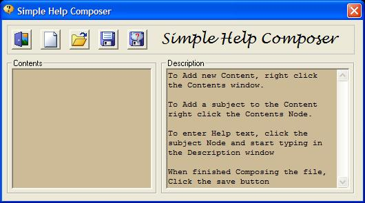



## Simple Help Composer

### Description

A companion to the popular Simple Help applet, Simple Help Composer allows you easily compose and save your help file. Simple, effective yet professional looking HELP file for all your VB projects. The download includes additional updates to the Simple Help applet and the Simple Help Composer.
 
### More Info
 

             |
---                |---
**Submitted On**   |2007-07-22 19:57:36
**By**             |[Richard Gagnon](https://github.com/Planet-Source-Code/PSCIndex/blob/master/ByAuthor/richard-gagnon.md)
**Level**          |Intermediate
**User Rating**    |5.0 (15 globes from 3 users)
**Compatibility**  |VB 6\.0
**Category**       |[Complete Applications](https://github.com/Planet-Source-Code/PSCIndex/blob/master/ByCategory/complete-applications__1-27.md)
**World**          |[Visual Basic](https://github.com/Planet-Source-Code/PSCIndex/blob/master/ByWorld/visual-basic.md)
**Archive File**   |[Simple\_Hel2076717222007\.zip](https://github.com/Planet-Source-Code/richard-gagnon-simple-help-composer__1-69002/archive/master.zip)

